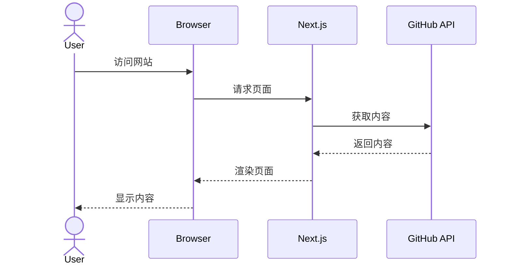
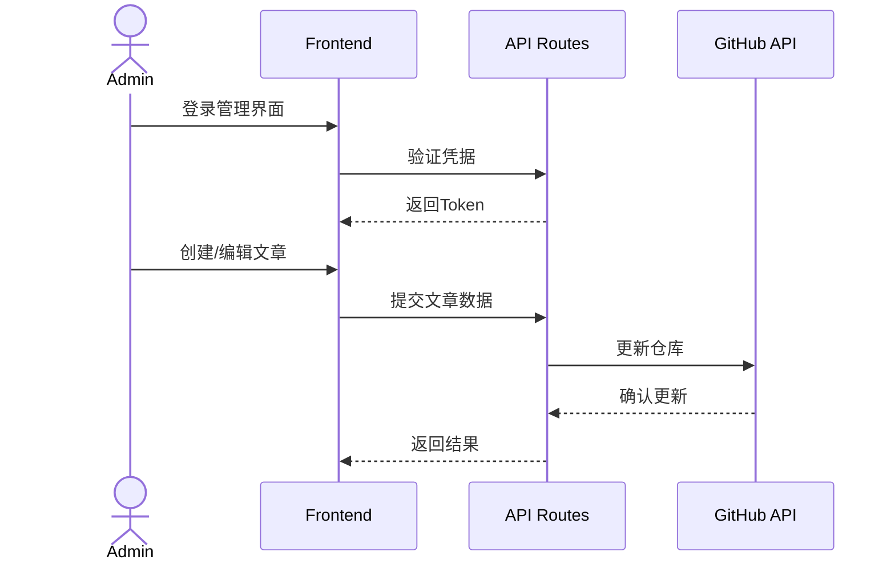
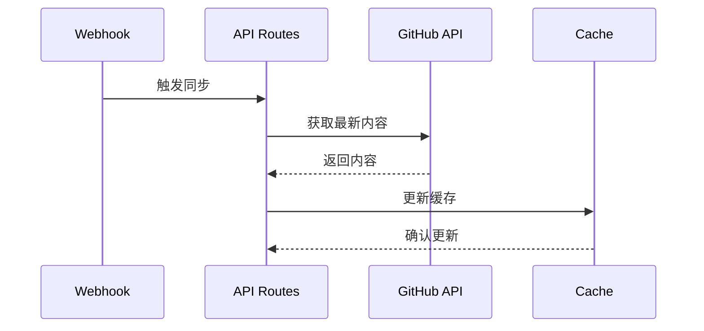

# GitBase

GitBase 是一个动态的、无数据库的网站内容管理系统，使用 Next.js、Tailwind CSS 和 Shadcn/UI 构建，通过 GitHub API 实现内容管理和版本控制。

## 项目结构 
gitbase/
├── src/
│ ├── app/ # Next.js 13+ App Router 目录
│ │ ├── api/ # API 路由
│ │ ├── admin/ # 管理界面
│ │ ├── posts/ # 文章页面
│ │ ├── resources/ # 资源页面
│ │ ├── login/ # 登录页面
│ │ └── page.tsx # 首页
│ ├── components/ # React 组件
│ │ ├── ui/ # UI 基础组件
│ │ └── ... # 业务组件
│ └── lib/ # 工具函数
├── data/ # 数据文件
│ ├── json/ # JSON 配置文件
│ └── md/ # Markdown 文章
├── public/ # 静态资源
└── package.json # 项目配置

## 技术栈

- **框架**: Next.js 14
- **样式**: Tailwind CSS
- **UI组件**: Shadcn/UI
- **内容管理**: GitHub API (Octokit)
- **内容格式**: Markdown (gray-matter, remark)

## 主要功能模块

### 1. 内容展示
- 文章列表和详情
- 资源列表
- 首页布局

### 2. 管理系统
- 登录认证
- 文章管理（CRUD）
- 资源管理

### 3. GitHub集成
- 内容同步
- 版本控制
- API 集成

## 特点
- 无需传统数据库
- 基于 GitHub 的版本控制
- 现代化的 UI 设计
- 响应式布局
- SEO 友好

## 编译和构建流程

### 1. 项目依赖和配置文件

#### package.json 核心脚本
json
{
    "scripts": {
        "dev": "next dev", // 开发环境
        "build": "next build", // 生产构建
        "start": "next start", // 生产环境运行
        "lint": "next lint" // 代码检查
    }
}

#### 主要构建工具配置

1. **TypeScript 配置 (tsconfig.json)**
json
{
    "compilerOptions": {
        "lib": ["dom", "dom.iterable", "esnext"],
        "paths": {
            "@/": ["./src/"] // 路径别名配置
            }
    }
}

2. **Tailwind 配置 (tailwind.config.ts)**
typescript:README.md
const config = {
content: [
'./pages//.{ts,tsx}',
'./components//.{ts,tsx}',
'./app//.{ts,tsx}',
'./src//.{ts,tsx}',
],
theme: {
// 主题配置
}
}

### 2. 构建流程

1. **开发环境**
   ```bash
   npm run dev
   ```
   - 启动开发服务器（默认端口 3000）
   - 启用热模块替换 (HMR)
   - 实时编译 TypeScript
   - 处理 Tailwind CSS

2. **生产构建**
   ```bash
   npm run build
   ```
   构建步骤：
   - TypeScript 类型检查
   - 代码编译
   - 静态页面生成 (SSG)
   - 代码优化和分割
   - 资源压缩

3. **生产环境运行**
   ```bash
   npm run start
   ```
   - 启动优化后的生产服务器
   - 提供构建后的静态资源

### 3. 关键构建特性

1. **自动代码分割**
   - 基于路由的代码分割
   - 动态导入优化

2. **静态资源优化**
   - 图片自动优化
   - 字体优化
   - CSS 压缩

3. **环境变量处理**
   - `.env` 文件支持
   - 运行时配置

## 入口和路由结构

### 1. 应用入口

#### 根布局 (src/app/layout.tsx)
```typescript
// 全局布局文件，包装所有页面
export default function RootLayout({ children }: RootLayoutProps) {
  return (
    <html lang="en">
      <body className={inter.className}>
        <Layout>{children}</Layout>
      </body>
    </html>
  )
}
```

#### 主页面 (src/app/page.tsx)
```typescript
export default function Home() {
  return (
    <div className="container mx-auto py-12 space-y-16">
      <section className="text-center space-y-4">
        <h1>GitBase</h1>
        <ResourceList resources={resources} />
        <ArticleList articles={allPostsData} />
      </section>
    </div>
  )
}
```

### 2. 路由结构

```
/                   # 首页
├── /posts          # 文章列表
│   └── /[slug]     # 文章详情
├── /resources      # 资源列表
├── /login          # 登录页面
└── /admin          # 管理后台（需要认证）
    ├── /articles   # 文章管理
    │   ├── /create # 创建文章
    │   └── /edit   # 编辑文章
    └── /resources  # 资源管理
```

### 3. API 路由

```
/api
├── /articles       # 文章相关 API
│   ├── GET        # 获取文章列表/单篇文章
│   ├── POST       # 创建新文章
│   └── PUT        # 更新文章
├── /resources     # 资源相关 API
│   ├── GET        # 获取资源列表
│   └── POST       # 更新资源
├── /login         # 登录认证
└── /check-auth    # 认证检查
```

### 4. 中间件处理

```javascript
// middleware.js
export function middleware(request) {
  // 管理后台路由保护
  if (path.startsWith('/admin')) {
    const isLoggedIn = token && verifyToken(token);
    if (!isLoggedIn) {
      return NextResponse.redirect('/login');
    }
  }
}
```

### 5. 关键特性

1. **App Router 架构**
   - 基于文件系统的路由
   - 内置布局系统
   - 服务器组件支持

2. **路由保护**
   - 中间件认证
   - 管理后台访问控制

3. **API 集成**
   - RESTful API 设计
   - GitHub API 集成
   - 错误处理

## 系统时序图

### 1. 用户访问流程



### 2. 文章管理流程



### 3. 内容同步流程



## 主要流程说明

1. **用户访问流程**
   - 用户通过浏览器访问网站
   - Next.js 服务器处理请求
   - 从 GitHub API 获取所需内容
   - 渲染页面并返回给用户

2. **文章管理流程**
   - 管理员登录验证
   - 通过管理界面进行内容操作
   - API 路由处理请求并与 GitHub API 交互
   - 更新内容并同步到仓库

3. **内容同步流程**
   - 通过 Webhook 触发同步
   - 获取 GitHub 最新内容
   - 更新本地缓存
   - 确保内容同步一致性