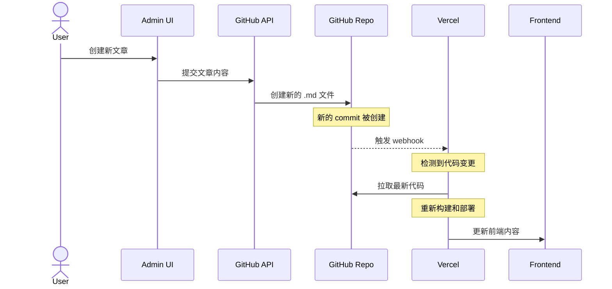

# GitBase 文章管理功能调试记录

## 问题描述
在使用 GitBase 系统时发现一个数据同步问题：通过管理后台创建的新文章在 Vercel 部署环境中可以看到，但在本地开发环境中无法显示。

## 问题分析过程

### 1. 初始猜想
最初认为可能是：
- 数据获取路径不一致
- 环境判断导致不同数据源
- 本地文件系统与 GitHub 不同步

### 2. 代码审查
检查了关键文件：
- `src/lib/posts.js`：文章数据获取
- `src/app/api/articles/route.js`：文章 API
- `src/app/api/articles/create/route.js`：文章创建
- `src/app/page.tsx`：首页展示

### 3. 问题根源
经过分析发现核心原因：
1. 创建文章时，通过 GitHub API 将文章保存到 GitHub 仓库
2. 保存操作产生新的 commit
3. 新的 commit 触发 Vercel 的自动部署
4. Vercel 重新部署时拉取最新代码，因此能看到新文章
5. 本地环境仍使用旧的文件，没有自动同步 GitHub 的更新

## 数据流程图


## 解决方案

### 1. 手动同步方案（采用）
创建文章后，在本地执行：
```bash
git pull origin main  # 拉取最新的文章文件
```

### 2. 自动同步方案（备选）
创建文件监听脚本：
```javascript
const { exec } = require('child_process');
const chokidar = require('chokidar');

// 监听 data/md 目录的变化
chokidar.watch('data/md').on('all', (event, path) => {
  console.log(`检测到文件变化: ${event} ${path}`);
  
  // 执行 git pull
  exec('git pull origin main', (error, stdout, stderr) => {
    if (error) {
      console.error(`执行错误: ${error}`);
      return;
    }
    console.log(`已同步最新内容: ${stdout}`);
  });
});
```

### 3. API 统一方案（备选）
修改数据获取逻辑，统一使用 GitHub API：
```typescript
export async function getSortedPostsData() {
  if (process.env.NODE_ENV === 'development') {
    // 开发环境：从 GitHub API 获取
    return await fetchPostsFromGitHub();
  } else {
    // 生产环境：使用本地文件
    return getPostsFromLocal();
  }
}
```

## 经验总结

1. **部署机制理解**
   - Vercel 的自动部署由 Git 操作触发
   - 每次 commit 都会导致重新部署
   - 部署时会拉取最新代码

2. **数据同步策略**
   - 本地开发环境需要手动同步
   - 可以根据需要选择自动或手动同步
   - 需要注意本地文件与远程仓库的一致性

3. **最佳实践建议**
   - 创建文章后及时同步本地代码
   - 开发前确保本地代码为最新
   - 可以考虑添加提醒或自动化脚本

## 后续优化方向

1. 考虑添加文章创建成功后的提示，提醒开发者同步本地代码
2. 可以开发 CLI 工具，简化同步操作
3. 探索更好的开发环境数据同步策略
4. 完善文档，说明本地开发注意事项
